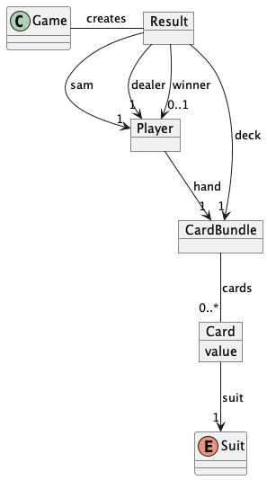
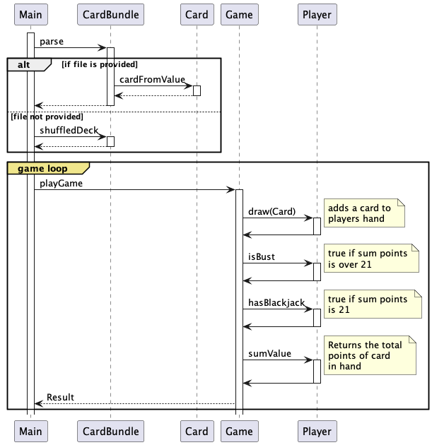

# Sytem requirements
- Maven 3.5 or later
- Java 11 or later

# How to build application

Package the app using maven:

```bash
mvn clean package 
```

# How to run application

_The following instructions are for Mac, Linux or Windows running WSL._

Execute the jar i ```target``` directory:

```bash
java -jar ./target/canyoubeatthedealerat21-jar-with-dependencies.jar
```

This will play the game using random shuffled deck.

The program can load decks stored as text files. To load a deck, add filename as parameter:

```bash
java -jar ./target/canyoubeatthedealerat21-jar-with-dependencies.jar <filenam>
```


For example, to use the file ```./decks/deck1.txt```:
```bash
java -jar ./target/canyoubeatthedealerat21-jar-with-dependencies.jar ./decks/deck1.txt
```


# Domain model


# Simplified sequence diagram
